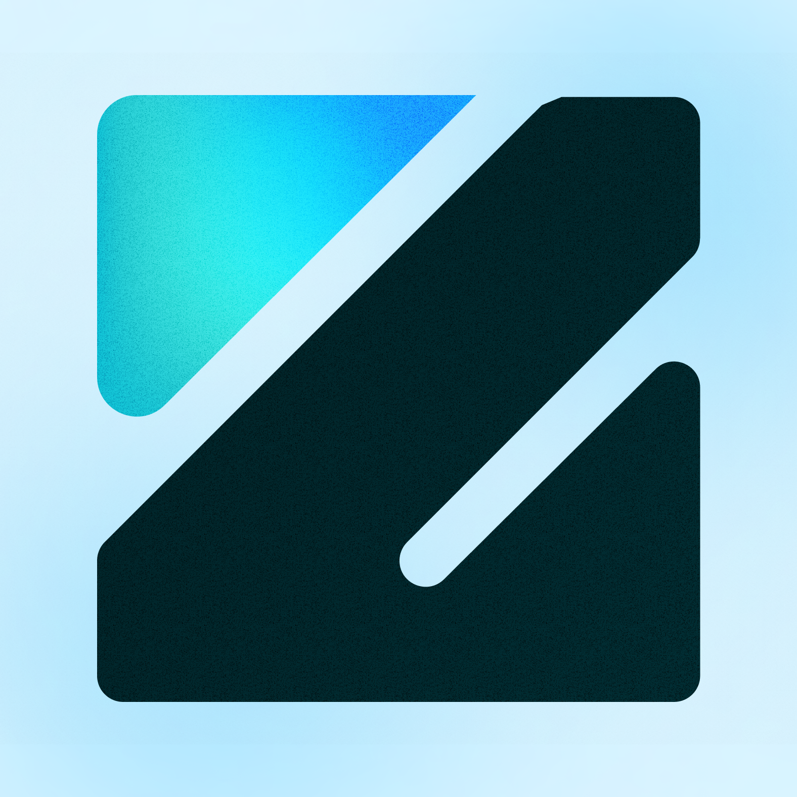

  
  

    
  
    

    
<h1 align="center">
    👋 Welcome to ZeeLabs!
</h1>

  <strong>We build custom AI agents that actually make a difference — securely, reliably, and at scale.</strong>
   
  <a href="https://zeelabs.ai/" target="_blank"><strong>Visit our Website »</strong></a>
   | 
  <a href="https://calendly.com/jose-zeelabs/zeelabs-talk-to-an-ai-expert"><strong>Book a Free Consultation »</strong></a>

---

ZeeLabs is an AI agency laser-focused on helping enterprise teams automate impactful work and make "we should automate that" a reality. We design, build, and launch production-grade AI agents tailored to your unique operational needs, often in a matter of weeks.

We've been on the other side — as founders, builders, and operators (as the team behind [Rely.io](https://rely.io/)) — and we know the journey from idea to a robust, production-ready AI solution can be challenging. That’s why we don’t just build impressive demos; we engineer AI agents that deliver tangible results and seamlessly integrate into your existing stack and workflows.

## 🚀 What We Do: AI Agents for Real-World Impact

We partner with businesses across diverse industries to create AI agents that tackle real work and drive significant efficiencies. Here are some of the innovative agents and automations we've built:

*   🗞️ **AI Pulse Newsletter Agent:**
    *   Fully automates newsletter creation by scraping YouTube, TikTok, X, LinkedIn, and over 20 news sites.
    *   Distills the best links, designs a beautiful layout, and sends the newsletter.
    *   *[Subscribe Here to our newsletter](https://zeelabs.ai/#ai-newsletter)*

*   📞 **Conversational Voice & SDR Agents:**
    *   **Inbound Voice Agent:** Answers calls, conducts consultative discovery, performs real-time research, and books meetings using sales psychology prompts. *(Try it on our [website](https://zeelabs.ai/))!*.
    *   **Cold Calling SDR Agent (Upcoming):** Will leverage our voice agent technology to cold call target personas, using your sales playbook, sales psychology, and live web research (from job descriptions, blogs, company news) for personalized outreach. This research capability also powers highly personalized outbound emails.

*   💡 **Content Ideas & Enhancement Agent:**
    *   Finds daily trending AI news and high-performing posts on LinkedIn, X, and other platforms.
    *   Suggests tailored content ideas and improves drafts using your unique tone and proven formats.
    *   *Goal: Amplify content output without sacrificing quality or authenticity.*

*   📝 **Sales Meeting Prep Agent:**
    *   Rapidly researches prospects and reviews past call transcripts.
    *   Generates a personalized "battle card" for sales teams in seconds, ensuring they're always prepared.

*   🎯 **AI Sales Coach Agent:**
    *   Analyzes call transcripts (from AI sales agents or human team members).
    *   Provides actionable coaching suggestions, such as identifying missed discovery opportunities or leading questions.

Our core mission is to help companies make AI an integral part of *how they work*, not just another underutilized tool.

## ✨ The Zee Way: Our Proven Process

Our rigorous methodology ensures reliable, scalable, and secure AI agent deployments:

1.  🔎 **Phase 01: Discovery**
    *   We collaborate closely with your stakeholders to pinpoint high-impact automation opportunities and build a compelling ROI case. This involves stakeholder interviews, in-depth process analysis, and thorough technical discovery.
2.  🛠️ **Phase 02: Implementation**
    *   Our expert engineers deliver production-grade agents specifically tailored to your existing technology stack. We prioritize security, observability, and testability, ensuring robust and seamless integration with your systems.
3.  🤝 **Phase 03: Knowledge Transfer & Support**
    *   We empower your team by providing comprehensive documentation, conducting training sessions, and ensuring a smooth handover. Alternatively, we can continue to manage and run the agent for you, offering ongoing support as needed.

## 🛡️ Enterprise-Grade: Secure, Compliant, and Open

We understand the critical importance of security and control for enterprises:

*   🔒 **Enforce Data Privacy:** We build self-hostable AI agents that prioritize your data's privacy by default. Expect secure container access and VPC peering, with no external data sharing unless explicitly configured by you.
*   📜 **Meet Regulatory Compliance:** Our solutions are built with rigorous security controls and documentation designed to meet stringent requirements like SOC-2. From Role-Based Access Control (RBAC) and audit trails to end-to-end encryption, we adhere to the highest standards.
*   🌍 **Open-Source First:** We leverage community-vetted, open-source components. This gives you full transparency, avoids vendor lock-in, and provides the freedom to customize everything to your specific needs.

## 🛠️ What You Might Find Here

This GitHub organization is a space where we plan to:

*   Share open-source projects, tools, and libraries related to AI development, MLOps, and agent-based systems.
*   Provide example implementations and proof-of-concepts.
*   Contribute to the broader AI and developer community.
*   Share insights, best practices, and learnings from our work in applied AI.

We are firm believers in the power of open collaboration and aim to contribute to the advancement of practical, impactful AI applications.

## 📰 Stay Updated with AI

Want to keep pace with the latest in Artificial Intelligence?
*   ➡️ **Subscribe to our AI Newsletter:** We send a quick daily email with the most important news, tools, and updates in AI – all in under 5 minutes.  ([Subscribe Here](https://resources.zeelabs.ai/ai-pulse))

## 🔗 Connect With Us & Learn More

*   🌐 **Website:** [zeelabs.ai](https://zeelabs.ai/)
*   🗣️ **Chat with our AI Voice Agent:** [Experience it live on our site!](https://zeelabs.ai/)
*   🗓️ **Book a Free Consultation:** [Speak with our AI Architects](https://calendly.com/jose-zeelabs/zeelabs-talk-to-an-ai-expert) to explore how AI can revolutionize your business.
*   📧 **Contact Us:** [jose@zeelabs.ai](mailto:jose@zeelabs.ai)
*   🏢 **About Our Team:** Learn more about the experienced team behind ZeeLabs (and formerly Rely.io) [here](https://resources.zeelabs.ai/about-us).

---

Thank you for visiting ZeeLabs on GitHub! We're passionate about building the future of AI and look forward to potentially collaborating with you.
